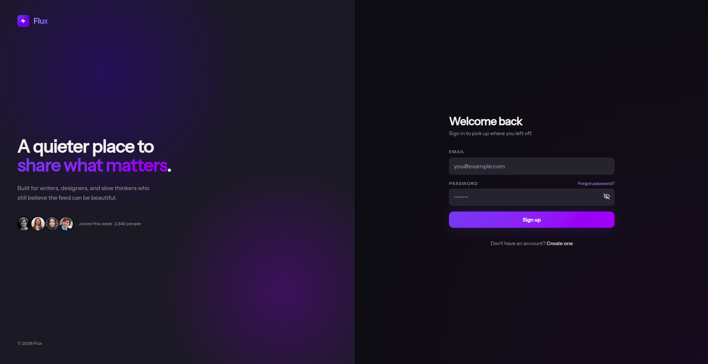
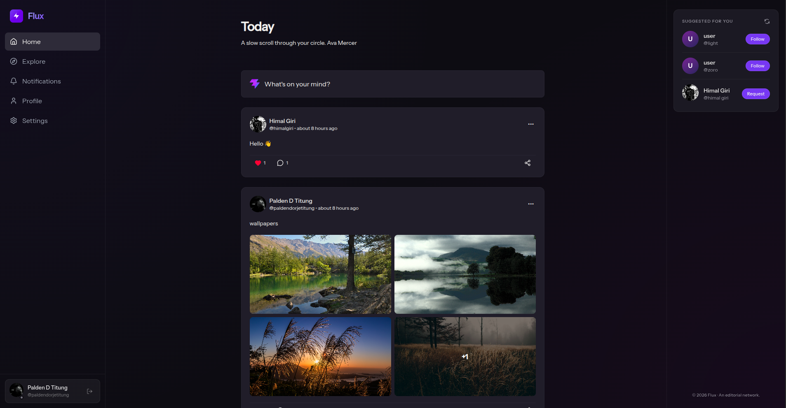
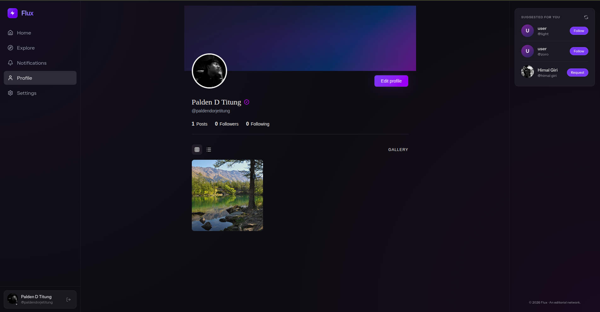

# Flux

A full-stack social media app built with the MERN stack and TypeScript. Features real-time notifications via Socket.io, a post reaction system, follow/unfollow, nested comments, and OTP-based email auth — deployed live on Vercel.

[](https://flux-delta-snowy.vercel.app/)

---

## Screenshots

| Login                                     | Home                                    | Profile                                       |
| ----------------------------------------- | --------------------------------------- | --------------------------------------------- |
|  |  |  |

---

## Features

- **Authentication** — Register/login with JWT. Forgot password flow uses 6-digit OTP sent via Nodemailer, verified server-side before allowing reset.
- **Posts** — Create posts with multiple image uploads via Cloudinary. Reaction to post.
- **Comments** — Nested comment system with per-comment likes. Comment tree resolved server-side and returned in a single query.
- **Real-time Notifications** — Socket.io rooms scoped per authenticated user. Notifications emit on follow, reaction, and comment events with client-side sound alerts and a live unread count badge.
- **Real-time Like & Comment Counts** — Like and comment counts update instantly across all connected clients via Socket.io.
- **Follow System** — Follow/unfollow with optimistic UI updates and rollback on failure. Follower/following counts kept consistent via functional `setState` to avoid stale closure bugs.
- **Profile** — Edit bio, avatar upload to Cloudinary. Avatar component handles missing images gracefully with initials fallback.
- **Search & Explore** — User search with debounced input. Explore feed surfaces content from non-followed users.
- **Settings** — Change password, manage account preferences.

---

## Tech Stack

### Frontend

| Tech                  | Usage                                            |
| --------------------- | ------------------------------------------------ |
| React 19 + TypeScript | UI framework                                     |
| Vite                  | Build tool                                       |
| Socket.io Client      | Real-time features                               |
| React Router v6       | Client-side routing                              |
| Context API           | Global state (auth, notifications, online users) |

### Backend

| Tech               | Usage                           |
| ------------------ | ------------------------------- |
| Node.js + Express  | REST API server                 |
| MongoDB + Mongoose | Database                        |
| Socket.io          | Real-time notification delivery |
| Cloudinary         | Image storage (posts + avatars) |
| JWT                | Stateless auth                  |
| Nodemailer         | OTP email delivery              |
| bcrypt             | Password hashing                |

---

## Project Structure

```
flux/
├── frontend/
│   └── src/
│       ├── features/
│       │   ├── auth/           # Login, register, forgot/reset password
│       │   ├── posts/          # PostCard, ShareButton
│       │   ├── comments/       # Nested comment thread, CommentLike
│       │   ├── notifications/  # NotificationsProvider, NotificationList
│       │   ├── profile/        # ProfilePage, EditProfile, Avatar, Lightbox
│       │   └── search/         # SearchPage, UserResult
│       └── shared/
│           ├── layouts/        # AppLayout, BottomNav, Sidebar
│           ├── components/     # Button, Modal, Avatar, etc.
│           ├── hooks/          # useAuth, useDebounce
│           └── services/       # Axios API client
└── backend/
    └── modules/
        ├── auth/               # Register, login, OTP reset
        ├── posts/              # CRUD, reactions, feed
        ├── comments/           # Nested comments, likes
        ├── notifications/      # Emit + persist notifications
        ├── users/              # Follow/unfollow, profile, block
        └── search/             # User + content search
```

---

## Challenges & Decisions

- **ObjectId vs string comparisons** — Several follow/block features had silent bugs where MongoDB ObjectIds were compared to plain strings. Fixed by normalizing to `.toString()` at the service layer and adding an `AppError` class with machine-readable error codes for easier debugging.
- **Stale follower counts** — Optimistic follow/unfollow updates were producing incorrect counts due to stale closure state. Resolved by switching all counter updates to functional `setState` (`prev => prev + 1`).
- **Socket.io auth race condition** — Notifications weren't delivering on first load because the socket connected before the auth context finished hydrating. Fixed by delaying socket initialization until the auth loading state resolved.

---

## Getting Started

### Prerequisites

- Node.js 18+
- MongoDB
- Cloudinary account

### Installation

```bash
git clone https://github.com/paldentitung/flux
cd flux

cd backend && npm install
cd ../frontend && npm install
```

### Environment Variables

**`backend/.env.local`**

```env
PORT=5000
MONGO_URI=your_mongodb_uri
JWT_SECRET=your_jwt_secret
CLOUDINARY_CLOUD_NAME=your_cloud_name
CLOUDINARY_API_KEY=your_api_key
CLOUDINARY_API_SECRET=your_api_secret
EMAIL_USER=your_email
EMAIL_PASS=your_email_password
CLIENT_URL=http://localhost:5173
```

**`frontend/.env.development`**

```env
VITE_API_URL=http://localhost:5000/api
VITE_SOCKET_URL=http://localhost:5000
```

### Run

```bash
# Terminal 1
cd backend && npm run dev

# Terminal 2
cd frontend && npm run dev
```

App runs at `http://localhost:5173`

---

## Author

**Palden Dorje Titung**

- Portfolio: [paldendorjetitung.com.np](https://www.paldendorjetitung.com.np/)
- GitHub: [@paldentitung](https://github.com/paldentitung)

---

## License

MIT
